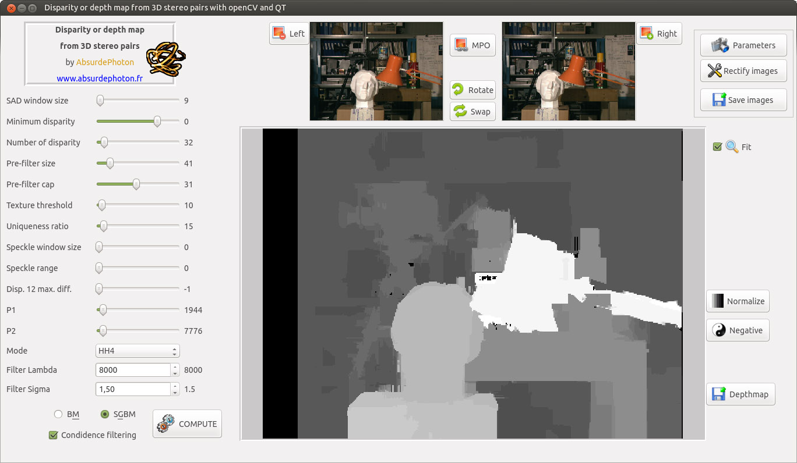

# disparity-filtering-mpo
### v1 - 2018-07-10
## Disparity and depth maps with QT and OpenCV with support for classic image files and MPO stereo pairs</b>

## LICENSE

The present code is under GPL v3 license, that means you can do almost whatever you want
with it!
I used bits of code from several sources, mainly from the openCV examples
 
 

## WHY?

I didn't find any simple tool (understand: GUI) to produce depth maps from my stereo pictures, and also my camera produces MPO files. So why not writing it myself ?
I'm not an ace of C++ and QT, in fact I only started using them some month ago. So, if you don't find my code pretty never mind, because it WORKS, and that's all I'm asking of it :)
 
 

## WITH WHAT?

Developed using:
* Linux: Ubuntu	16.04
* QT Creator 3.5.1
* QT 5.5.1
* openCV 3.4.1

This software should also work under Microsoft Windows: if you tried it successfully please contact me.
 
 

## HOW?

You will need the calibration files for your camera / lens, produced by my calibration utility : https://github.com/AbsurdePhoton/calib-mpo
 

The rest of the explanation will come soon, promise!
 
 

Enjoy!
 

## Enjoy!

### AbsurdePhoton
My photographer website ''Photongénique'': www.absurdephoton.fr
